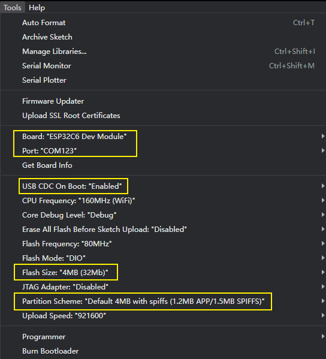

<h1 align = "center">🌟T-Knob🌟</h1>

* [切换到中文版](./README_CN.md)

## :one: Product
Other data is placed in the `0_shc` folder
|  Arduion IDE  |                                                          v2.2.1                                                          |
|:-------------:|:------------------------------------------------------------------------------------------------------------------------:|
|    Module     | [esp32-C6-MINI-1U](https://www.espressif.com/sites/default/files/documentation/esp32-c6-mini-1_mini-1u_datasheet_en.pdf) |
| MotorDriverIC |   [TMC6300](https://docs.sparkfun.com/SparkFun_IoT_Brushless_Motor_Driver/assets/component_documentation/TMC6300.pdf)    |
|  HallSensor   |                              [MT6701](https://www.magntek.com.cn/upload/MT6701_Rev.1.0.pdf)                              |

## :two: Example

The file structure is as follows:
~~~
├─0_shc : Store chip data and schematics about the project;
├─1_simple_drive : Let the electric motor up, using 6-step commutation drive motor;
├─2_encoder_mt6701 : Drive magnetic encoder, serial print read data;
├─3_mcpwm_ctrl : mcpwm controller drives the motor;
├─4_mcpwm_mt6701 : mcpwm controller is used to drive the motor and read the encoder data at the same time.
├─5_foc_openloop_velocity : foc open-loop speed control is used to drive the motor.
├─6_foc_openloop_angle : foc Angle control drive motor;
├─7_foc_closeloop_pos_and_speed : foc Angle control drive motor;
├─8_pid_and_lowpadd_filter : On the basis of 7, add pid control and low-pass filtering;
└─T-MotorDriver-C6-firmware : The firmware generated by 8 compilation is used as a factory program;
~~~

## :two: Arduion Quick Start
1. Install [Arduino IDE](https://www.arduino.cc/en/software)
2. Install the esp32 toolkit, open the Arduion IDE, click on `File->Perferences`, Then `https://espressif.github.io/arduino-esp32/package_esp32_dev_index.json` paste to the position of the diagram below, then click :ok:, waiting for the toolkit download is complete;

3. Open a example using the Arduion IDE, and configure the Arduion as follows.Notice where the yellow boxes are.

:exclamation: :exclamation: **Note: If the `board` cannot find the ESP32C6, perform the `step 2`.** :exclamation: :exclamation:

4. Finally click update :arrow_right: to download the program.

