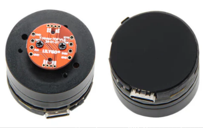
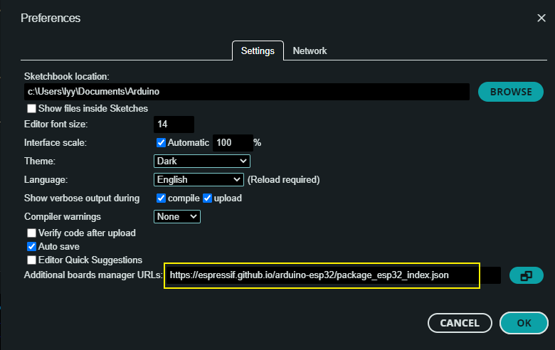
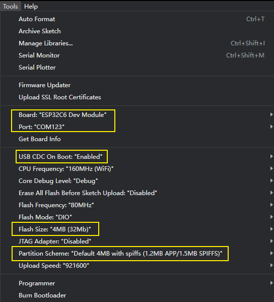

<h1 align = "center">🌟T-Knob🌟</h1>

 
  
  

<!-- * [切换到中文版](./README_CN.md) -->

## :zero: Version 🎁

### 1、Latest version

### 2、Where to buy.
[LilyGo Store](https://lilygo.cc/products/t-knob)

## :one: Product 🎁

Other data is placed in the `hardware` folder
|  Arduion IDE  |                                                          v2.2.1                                                          |
|:-------------:|:------------------------------------------------------------------------------------------------------------------------:|
|    Module     | [esp32-C6-MINI-1U](https://www.espressif.com/sites/default/files/documentation/esp32-c6-mini-1_mini-1u_datasheet_en.pdf) |
| MotorDriverIC |   [TMC6300](https://docs.sparkfun.com/SparkFun_IoT_Brushless_Motor_Driver/assets/component_documentation/TMC6300.pdf)    |
|  HallSensor   |                              [MT6701](https://www.magntek.com.cn/upload/MT6701_Rev.1.0.pdf)                              |

## :two: Module 🎁

### 1、Folder structure:
~~~
├─3D_File : 3D model file;
├─example : Some examples;
├─firmare : `factory` compiled firmware;
├─hardware: Schematic diagram of the board, chip data;
~~~

### 2、Examples

~~~
- ✅ 1_simple_drive : Let the electric motor up, using 6-step commutation drive motor;
- ✅ 2_encoder_mt6701 : Drive magnetic encoder, serial print read data;
- ✅ 3_mcpwm_ctrl : mcpwm controller drives the motor;
- ✅ 4_mcpwm_mt6701 : mcpwm controller is used to drive the motor and read the encoder data at the same time.
- ✅ 5_foc_openloop_velocity : foc open-loop speed control is used to drive the motor.
- ✅ 6_foc_openloop_angle : foc Angle control drive motor;
- ✅ 7_foc_closeloop_pos_and_speed : foc Angle control drive motor;
- ✅ 8_pid_and_lowpadd_filter : On the basis of 7, add pid control and low-pass filtering;
- ✅ T-MotorDriver-C6-firmware : The firmware generated by 8 compilation is used as a factory program;
~~~

## :three: Quick Start 🎁

1. Install [Arduino IDE](https://www.arduino.cc/en/software)
2. Install the esp32 toolkit, open the Arduion IDE, click on `File->Perferences`, Then `https://espressif.github.io/arduino-esp32/package_esp32_dev_index.json` paste to the position of the diagram below, then click :ok:, waiting for the toolkit download is complete;

3. Open a example using the Arduion IDE, and configure the Arduion as follows.Notice where the yellow boxes are.

:exclamation: :exclamation: **Note: If the `board` cannot find the ESP32C6, perform the `step 2`.** :exclamation: :exclamation:

4. Finally click update :arrow_right: to download the program.

## :four: Pins 🎁

~~~c
// MT6071
#define MAG_CS  7
#define MAG_CLK 14
#define MAG_DIO 15

// MTC6300
#define BLDC_DRV_FAULT_GPIO 2
#define UH_PIN 6
#define UL_PIN 5
#define VH_PIN 1
#define VL_PIN 3
#define WH_PIN 0
#define WL_PIN 4

// BOOT & LED
#define BTN_RELEASE_STATE 1  // HIGH is release state
#define BOARD_BOOT 9
#define BOARD_LED1 23
#define BOARD_LED2 22
#define BOARD_LED3 21
#define BOARD_LED4 20
#define BOARD_BUZZ 18
~~~

## :five: Test 🎁

## :six: FAQ 🎁

## :seven: Schematic & 3D 🎁

For more information, see the `./hardware` directory.

Schematic : [T-Embed-CC1101](./hardware/T-Embed-CC1101%20V1.0%2024-07-29.pdf)

CC1101 Schematic : [CC1101](./hardware/cc1101-shield.pdf)

CC1101 Pins : [CC1101 Pins](./hardware/CC1101_pin.png)

3D Files : To be added ...
