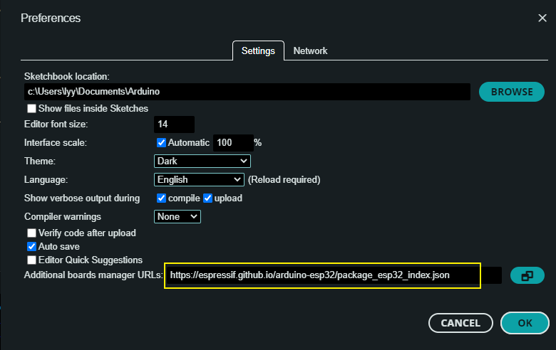
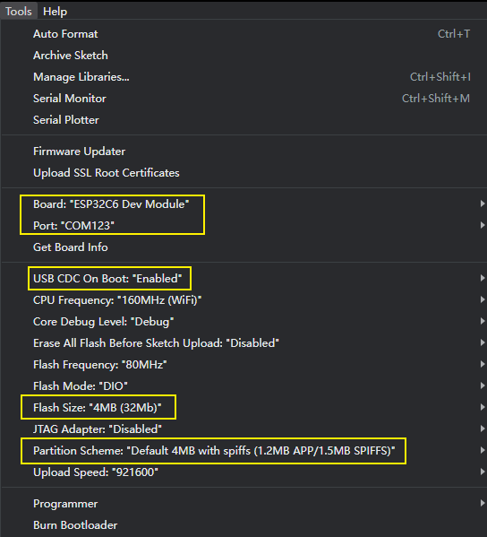

<h1 align = "center">🌟T-Knob🌟</h1>

* [Switch to English](./README.md)

## :one: Product

更多的资料放在 `0_shc` 文件夹下面；

| Arduion IDE |                                                          v2.2.1                                                          |
|:-----------:|:------------------------------------------------------------------------------------------------------------------------:|
|    模组     | [esp32-C6-MINI-1U](https://www.espressif.com/sites/default/files/documentation/esp32-c6-mini-1_mini-1u_datasheet_en.pdf) |
|  电机驱动   |   [TMC6300](https://docs.sparkfun.com/SparkFun_IoT_Brushless_Motor_Driver/assets/component_documentation/TMC6300.pdf)    |
| 磁性编码器  |                              [MT6701](https://www.magntek.com.cn/upload/MT6701_Rev.1.0.pdf)                              |

## :two: Example

这个项目的文件结构如下:
~~~
├─0_shc ：                          存放关于项目的芯片资料和原理图；
├─1_simple_drive ：                 让电机动起来，采用6步换向驱动电机；
├─2_encoder_mt6701 ：               驱动磁编码器，串口打印读到的数据；
├─3_mcpwm_ctrl ：                   用 mcpwm 控制器驱动电机；
├─4_mcpwm_mt6701 ：                 用 mcpwm 控制器驱动电机同时读编码器的数据；
├─5_foc_openloop_velocity ：        采用 foc 开环速度控制驱动电机；
├─6_foc_openloop_angle ：           采用 foc 角度控制驱动电机；
├─7_foc_closeloop_pos_and_speed ：  用速度环闭环和角度闭环控制电机；
├─8_pid_and_lowpadd_filter ：       在7的基础上，添加 pid 控制和低通滤波；
└─T-MotorDriver-C6-firmware ：      用8编译生成的固件，用作出厂程序；
~~~

## :two: Arduion 快速开始
1. 安装 [Arduino IDE](https://www.arduino.cc/en/software)，并且克隆或下载此项目；
2. 安装 esp32 的工具包，打开 Arduion IDE，点击打开 `File->Perferences`，然后将 `https://espressif.github.io/arduino-esp32/package_esp32_dev_index.json` 粘贴到如下图的位置，然后点击 :ok:，等待工具包下载完成；

3. 用 Arduion IDE 打开一个例子，然后按照下面的方式配置，注意图中黄色框框的选项。

:exclamation: :exclamation: **注意：如果 `board` 找不到 ESP32C6 ，请执行第二步操作.**:exclamation: :exclamation:

4. Finally click update :arrow_right: to download the program.

- [T-MotorDriver-C6 V1.0](./hardware/T-MotorDriver-C6%20V1.0.pdf)
- [MT6701](./hardware/MT6701_Rev.1.0.pdf)
- [TMC6300](./hardware/TMC6300_datasheet_rev1.08.pdf)
- [3D Files](./3D_File/H718-20240809.stp)

